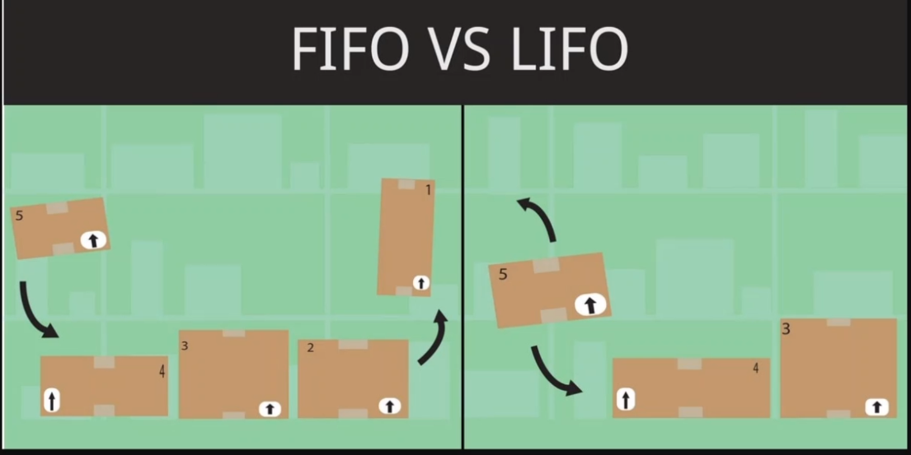

# 32-conceitos-que-todo-desenvolvedor-JavaScript-deveria-saber

1. Introdução

- [https://github.com/leonardomso/33-js-concepts](https://github.com/leonardomso/33-js-concepts)

2. 1 - Pilha de chamadas

```js
// first in firts out = FIFO = O primeiro que entrou é o primeiro a sair
// last in las outr = LIFO = O último que entra é o primeiro que sai

function funcao1() {
funcao2();
console.log('executou função 1');
}

function funcao2() {
funcao3();
console.log('executou função 2');
}

function funcao3() {
console.log('executou função 3');
}

funcao1();
/*
executou função 3
executou função 2
executou função 1
*/

```

3. 2 - Tipos primitivos

- []()

```javascript
console.log(typeof true); // boolean
console.log(typeof Boolean(true)); // boolean
console.log(typeof new Boolean(true)); // object
console.log(typeof 'Malcher'); // string
console.log(typeof 28); // number

console.log('Malcher'.length); // 7

var doze = new Number(12); //
var quinze = doze + 3;
console.log(quinze); //15

console.log(typeof doze); // object
console.log(typeof quinze);// number

```

4. 3 - Tipos de valores e tipos de referência

- [js/3-Tipos-de-valores-e-tipos-de-referencia.js](js/3-Tipos-de-valores-e-tipos-de-referencia.js)

```javascript
var x = 10; // mem.001 = nome é x, e o calor é 10
var y = x;
x = 20;
console.log(x, y); // 20  10

var t = {valor: 10}
var f = x;
t.valor = 80;
f.valur = 40;
/*
local mem.0002 = {valor: 10}
variavel t = mem.0002
variavel f = t = mem.0002
*/

console.log(t); // { valor: 80 }
console.log(f); // 20


```

5. 4 - Implícito, Explicito e chamada de métodos

- [js/4-Implicito-Explicito-e-chamada-de-metodos.js](js/4-Implicito-Explicito-e-chamada-de-metodos.js)

```javascript
// COERÇÃO
console.log('5' - 5) // 0
console.log('5' + 5) // 55
console.log(true + 1)// 2
console.log(true + true) // 2
console.log([] + {}) // [object Object]
console.log([] + []) //

// IMPLICITO
console.log(+'5') // 5
console.log(5+ '')// 5
console.log(123 && 'oi')// oi
console.log(null || true)// true

//Explicito
console.log(Number('50')) // 50
console.log(String(50))   // 50

/*
JAVA
Public Integer somaNumeros(Integer a, Integer b){return a+ b}
JavaScript
function somaNumeros(a,b){return a + b} 
*/

```

6. 5 - == vs === vs typeof

- [js/5-two-equal-vs-triple-equal-vs-typeof.js](js/5-two-equal-vs-triple-equal-vs-typeof.js)

```javascript
// == e ===

// ==
console.log(3 == '3'); // true

/*
1 SE ambos são do mesmo tipo
null == underfined, se for, ele retorna true
number == string, se for, ele vai converter a string num numero
boolean == number, se for, ele converte o boolean num numero
boolean == string, se for, ele converte a string ara o boolean
objeto == primitivo, se for, ele converte o objeto numa string
*/

// ===
console.log(3 === '3');// false
console.log(3 === 3);// true

// É necessário que os valores e os tipos sejam iguais para ser true

//typeof
// é otimo para validação de tipos
console.log(typeof 'Malcher' === 'string')// true

```

7. 6 - Escopo global, de função, do bloco e léxico

- [js/6-Escopo-global-de-funcao-do-bloco-e-lexico.js](js/6-Escopo-global-de-funcao-do-bloco-e-lexico.js)

```javascript
// var, let, const

// LEXICO

var name = 'Malcher';
function testeLexico() {
    function testeLexico2() {
        var variavel = "meu nome";
    }
}
testeLexico();

// GLOBAL
var a = 0;

function alterar() {
    a = 10;
}

console.log(a); // 0
alterar();
console.log(a); // 10

// Função
// igual o escopo Lexico, o que é criado dentro da função
// não esta disponivel fora dela

// BLoco
function bloco(){
    var teste;
    if (true) {
        teste = 'teste';
        //let teste2 = 'teste2'; //error
        var teste2 = 'teste2'; // OK - var fica disponivel para função
    }
    console.log('teste', teste);
    console.log('teste2', teste2);
    // teste teste
    // teste2 teste2
}
bloco();

// Hoisting
function blocoH(){
    var teste;
    var teste2; // <<<<<-------
    if (true) {
        teste = 'teste';
        teste2 = 'teste2'; // <<<-----------
    }
    console.log('teste', teste);
    console.log('teste2', teste2);
    // teste teste
    // teste2 teste2
}
bloco();

```

8. 7 - Expressão e Declaração

- [js/7-Expressao-e-Declaracao.js](js/7-Expressao-e-Declaracao.js)

```javascript
console.log(1 + 1);
console.log(Math.random() + 5)

function expressao() {
    return 1 + 1
}

console.log(expressao());

var variavel = 20;

if (true) {
    variavel = 30;
}

function soma(a) {
    return a + 10;
}

console.log(soma(Math.random()));

function teste(){
    variavel = 40;
}

```

9. 8.a - IIFE e Namespaces

- [js/8-a-IIFE-e-Namespaces.js](js/8-a-IIFE-e-Namespaces.js)

```javascript
/*
const alerta = function () {
    console.log('alerta!');
};
alerta();
// alerta!
*/
/*
!function () {
    console.log('ALERTA');
}();
// ALERTA
*/
/*
(function (){
    console.log('Alerta ()()')
})()
// Alerta ()()
*/
/*
!function teste() {
    console.log('com nome da funcao')
}();
// com nome da funcao
*/
/*
var variavel = 30
!function (){
    variavel = 99
}()
console.log(variavel); // 99
*/
var dados = (function (){
    var contador = 0;
    return {
        incrementar: function () {
            contador = contador + 1;
            return contador;
        }
    }
})();

console.log(dados.incrementar()); // 1
console.log(dados.incrementar()); // 2
console.log(dados.incrementar()); // 3
console.log(dados.contator); //undefined

```

10. 8.b - Módulos

- [js/8-b-Modulos-utilitario.js](js/8-b-Modulos-utilitario.js)

```javascript
const valor = 5;

const helloWord = function () {
    console.log('OLÁ MUNDO');
};

const multiplica = function (x) {
    console.log(x * valor);
};

//export {helloWord, multiplica};
export default helloWord;


```

- [js/8-b-Modulos-app.js](js/8-b-Modulos-app.js)

```javascript
//import {helloWord as olamundo, multiplica} from "./8-b-Modulos-utilitario.js";
//import {helloWord,  multiplica} from "./8-b-Modulos-utilitario.js";
//helloWord();
//olamundo();

import helloWord from "./8-b-Modulos-utilitario.js";

helloWord();

```

11. 9 - Fila de eventos e Pilha de eventos


- [js/9-Fila-de-eventos-e-Pilha-de-eventos.js](js/9-Fila-de-eventos-e-Pilha-de-eventos.js)

```javascript
function loopEventos() {
    console.log('a');
    for (let i = 1; i <= 4; i++) {
        console.log( 'b - ' + i)
    }
    console.log('c');

    setTimeout(() => {
        console.log('d');
    }, 0);
    console.log('e');
}

loopEventos();
/*
a
b - 1
b - 2
b - 3
b - 4
c
e
d
*/

```

12. 10 - SetTimeout, SetInterval, requestAnimationFrame

- [js/10-SetTimeout-SetInterval-requestAnimationFrame.js](js/10-SetTimeout-SetInterval-requestAnimationFrame.js)

```javascript
/*
const mostraAlerta = (nome) => {
    console.log('Set Timeout - ' + nome);
};

const timeout = setTimeout(mostraAlerta, 3500, 'Malcher Jr');
// Set Timeout - Malcher Jr

setTimeout(()=>{
    clearTimeout(timeout); // 'calcela' timeout
}, 1500)
*/

/*
const interval = setInterval(() => {
    console.log('teste');
}, 1000)

setInterval(()=> {
    clearInterval(interval);
}, 5000)
*/

/*
teste
teste
teste
teste
*/

let contador = 0;

function animation() {
    contador += 1;
    console.log(contador);
    loop = requestAnimationFrame(animation);
}

let loop = requestAnimationFrame(animation);

setTimeout(() => {
    cancelAnimationFrame(loop);
}, 5000)

```

13. 11 - Operadores Bitwise

- [js/11-Operadores-Bitwise.js](js/11-Operadores-Bitwise.js)

```javascript
console.log(Number(113).toString(2)); // 1110001
console.log(parseInt('1110001', 2)); // 113

// 00000001 = 1
// 00000010 = 2
// 00000011 = R

console.log(3 & 2); // 2
console.log(parseInt(11, 2)); // 3

```

14. 12 - DOM e Árvore de layout


15. 13.a - Factories

- [js/13-a-Factories.js](js/13-a-Factories.js)

```javascript
const Mamifero = function (nome, som) {
    return {nome, som}
};

const cachorro = Mamifero('Cachorro', 'auaua');
console.log(cachorro);
//{ nome: 'Cachorro', som: 'auaua' }

```

16. 13.b - Classes

- [js/13-b-Classes.js](js/13-b-Classes.js)

```javascript
class Animal {
    constructor(pes) {
        this.pes = pes;
    }

    quantidadePes() {
        console.log('Eu Tenho ' + this.pes + ' pés/patas');
    }
}

class Mamifero extends Animal{

    constructor(nome, som, pes) {
        super(pes);
        this.nome = nome;
        this.som = som;
    }

    emitirSOm() {
        console.log('Esse animal faz ' + this.som);
    }
}

const cachorro = new Mamifero('Cachorro', 'auau', 4);
cachorro.emitirSOm(); // Esse animal faz auau
cachorro.quantidadePes(); // Eu Tenho 4 pés/patas


```

17. 14 - This, call, apply e bind

- [js/14-This-call-apply-e-bind.js](js/14-This-call-apply-e-bind.js)

```javascript
// inspect code
function teste() {
    console.log(this)
}
// teste();
// window {...}

//const dados = {nome: 'Malcher Jr.'};
/*
const saudacao = function (idade) {
    console.log(`Bem vindo ${this.nome}, sua idade é ${idade}`);
};
*/
// saudacao.call(dados, 36);
// Bem vindo Gabriel, sua idade é 36

/*
const dados = { nome : 'Malcher Jr'};
const argumentos = [36];
const saudacao = function (idade) {
    console.log(`Bem vindo ${this.nome}, sua idade é ${idade}`)
};
*/
// saudacao.apply(dados, argumentos);
// Bem vindo Malcher Jr, sua idade é 36

const dados = {nome: 'Malcher Jr'}
const saudacao = function (idade) {
    console.log(`Bem vindo ${this.nome}, sua idade é ${idade}`)
};
const bound = saudacao.bind(dados);
// bound(36);
// Bem vindo Malcher Jr, sua idade é 36
```

18. 15 - new, constructor e instanceof

- [js/15-new-constructor-e-instanceof.js](js/15-new-constructor-e-instanceof.js)

```javascript
function Usuario(nome) {
    // this = {}
    this.nome = nome;
    this.log = function () {
        console.log(this);
    };
    // return this
}

const jose = new Usuario('Jose');
console.log(jose); // Usuario { nome: 'Jose', log: [Function (anonymous)] }
console.log(jose instanceof Usuario); // true
console.log(jose instanceof String); // false

```

19. 16 - Prototype inheritance e prototype chain

- [js/16-Prototype-inheritance-e-prototype-chain.js](js/16-Prototype-inheritance-e-prototype-chain.js)

```javascript
const Usuario = function (nome) {
    this.nome = nome;
};

const jose = new Usuario('Jose');

Usuario.prototype.getNome = function () {
    console.log(this.nome);
};

jose.getNome(); // jose

// jose.__proto__ // {getNome: f, contructor: f ...}

```

20. 17.a - Object.create

- [js/17-a-Object-create.js](js/17-a-Object-create.js)

```javascript
/*

let Usuario = function (nome, idade) {
    this.nome = nome;
    this.idade = idade;
};

const jose = new Usuario('Jose', 36);
const novoJose = Object.create(jose);
console.log(novoJose instanceof Usuario); // true
console.log(novoJose.nome); // Jose

*/

function Carro(cor) {
    this.cor = cor;
    this.descricao = descricao;
}

Carro.prototype.pegaInformacaoes = function () {
    return this.descricao + ' e a cor ' + this.cor;
};

let meuCarro = Object.create(Carro.prototype);
meuCarro.cor = 'Azul';
// console.log(meuCarro.pegaInformacaoes()); // undefined e a cor Azul

const novoCarro = Object.create(Carro, {
    cor: {writable: true, configurable: true, value: 'vermelho'},
    descricaoPadrao: {writable: false, configurable: true, value: 'Meu carro'},
    descricao: {
        configurable: true,
        get: function () {
            return this.descricaoPadrao.toUpperCase();
        },
        set: function (valor) {
            this.descricaoPadrao = valor.toLowerCase();
        }
    }
})
novoCarro.descricaoPadrao = 'Nova Descricao...';
console.log(novoCarro.descricao);
// MEU CARRO

```

21. 17.b - Object.assign

- [js/17-b-Object-assign.js](js/17-b-Object-assign.js)

```javascript
const alvo = {a: 1, b: 2}
const dados = {b: 1, c: 2}
const resultado = Object.assign(alvo, dados);
resultado.a = 'a';
console.log(resultado); // { a: 'a', b: 1, c: 2 }
console.log(alvo); // { a: 'a', b: 1, c: 2 }

const obj1 = {a: 1, b: 3}
const obj2 = {c: 4, d: 5}
const result = Object.assign({}, obj1, obj2);
console.log(result);
// { a: 1, b: 3, c: 4, d: 5 }


```

22. 18 - map, reduce e filter

- [js/18-map-reduce-e-filter.js](js/18-map-reduce-e-filter.js)

```javascript
dados = [
    {nome: 'Caramelo', idade: 3, tipo: 'Cachorro'},
    {nome: 'Rex', idade: 6, tipo: 'Cachorro'},
    {nome: 'Bolota', idade: 9, tipo: 'gato'},
    {nome: 'thor', idade: 2, tipo: 'Cachorro'},
]

const cachorros = dados.filter((dado, index) => dado.tipo === 'Cachorro');
const idadeReal = cachorros.map((cachorro) => ({
    nome: cachorro.nome,
    idade: cachorro.idade * 7
}));
const totalIdades = idadeReal.reduce((soma = 0, dado) => {
    return soma + dado.idade;
}, 0)
//console.log(totalIdades) // 77

const idade = dados.filter((dado, index) => dado.tipo === 'Cachorro')
    .map((cachorro) => ({nome: cachorro.nome, idade: cachorro.idade * 7}))
    .reduce((soma = 0, dado) => {
        return soma + dado.idade;
    }, 0)
console.log(idade); // 77

```

23. 19.a - Pure functions e side effects

- [js/19-a-Pure-functions-e-side-effects.js](js/19-a-Pure-functions-e-side-effects.js)

```javascript
/*
const soma = (x, y) => X + y;

let nome = '';
const alterarNome = (novoNome) => {
    nome = novoNome;
};
*/
const usuario = {nome: 'Malcher JR', pontos: 0}
/*
const alteraUsuario = (usuario) => {
    usuario.nome = usuario.nome.toUpperCase();
    usuario.pontos += 1;
    return usuario;
}
alteraUsuario(usuario);
console.log(usuario) // { nome: 'MALCHER JR', pontos: 1 }
*/
const nomeMaiusculo     = (nome)   => nome.toUpperCase();
const incrementaPontos  = (pontos) => pontos + 1;
usuario.nome   = nomeMaiusculo(usuario.nome);
usuario.pontos = incrementaPontos(usuario.pontos);
console.log(usuario) // { nome: 'MALCHER JR', pontos: 1 }


```

24. 19.b - State Mutation

- [js/19-b-State-Mutation.js](js/19-b-State-Mutation.js)

```javascript
const pedido = {titulo: 'Meu Pedido', status: false}

const copiaPedido = (pedido) => {
    const novoPedido = Object.assign({}, pedido);
    novoPedido.status = true;
    return novoPedido;
}

const novoPedido = copiaPedido(pedido);
novoPedido.titulo = 'Segundo Pedido';

console.log(pedido)     // { titulo: 'Meu Pedido', status: false }
console.log(novoPedido) // { titulo: 'Segundo Pedido', status: true }

```

25. 20 - Closures

- [js/20-Closures.js](js/20-Closures.js)

```javascript
var nome = 'Malcher jR';

function olaPessoa() {
    console.log('Olá ' + nome);
}

nome = 'JOSE';
olaPessoa(); // Olá JOSE

function buscaItem() {
    var numeroItem = 200;
    fetch('/minha/url/do/banco?item=' + numeroItem, {
        method: 'GET'
    }).then(resultado => {
        console.log('Busca pelo item ' + numeroItem + ' deu certo');
    })
}


```

26. 21 - High Order Functions

- [js/21-High-Order-Functions.js](js/21-High-Order-Functions.js)

```javascript
function mostraAlerta() {
    alert('Clicou no logo');
}

document.getElementById('logo-default')
    .addEventListener('click', mostraAlerta);

const maiusculo = function (texto) {
    return texto.toUpperCase();
};

maiusculo('malcher');

function chamaAlerta() {
    return mostraAlerta();
}

chamaAlerta()();


```

27. 22 - Recursion

- [js/22-Recursion.js](js/22-Recursion.js)

```javascript
/*
function contagem(numero) {
    console.log(numero);
    if (numero > 0) {
        contagem(numero - 1);
    }
}
*/

function contagem(numero) {
    for (; numero > 0; numero--) {
        console.log(numero)
    }
}

contagem(5);

/*
5
4
3
2
1
*/

```

28. 23.a - Collections

- [js/23-a-Collections.js](js/23-a-Collections.js)

```javascript
const alfabeto = new Set(['a', 'b', 'c', 'c']);

console.log(alfabeto) // Set(3) { 'a', 'b', 'c' }

alfabeto.add('a');

console.log(alfabeto) // Set(3) { 'a', 'b', 'c' }

console.log(alfabeto.has('a')); // true

console.log(alfabeto[0]); // undefined

alfabeto.add('d');
alfabeto.add('e');
console.log(alfabeto) // Set(5) { 'a', 'b', 'c', 'd', 'e' }

alfabeto.delete('b');
console.log(alfabeto) // Set(4) { 'a', 'c', 'd', 'e' }

let dados = [1, 2, 3, 4, 5, 5, 5];
const numeros = new Set(dados);
console.log(numeros); // Set(5) { 1, 2, 3, 4, 5 }

dados = Array.from(numeros);
console.log(dados); // [ 1, 2, 3, 4, 5 ]

/* ------------------ */

const dadosMap = new Map([['nome', 'malcher'], ['idade', 36]]);
console.log(dadosMap);
// Map(2) { 'nome' => 'malcher', 'idade' => 36 }

dadosMap.set('estado', 'São Paulo');
console.log(dadosMap);
// Map(3) { 'nome' => 'malcher', 'idade' => 36, 'estado' => 'São Paulo' }

console.log(dadosMap.get('nome')) // malcher

dadosMap.forEach((dado, chave) => {
    console.log(dado, chave)
})
/*
malcher nome
36 idade
São Paulo estado
*/

```

29. 23.b - Generators

- [js/23-b-Generators.js](js/23-b-Generators.js)

```javascript
function iteraNumeros(total) {
    for (let i = 1; i <= total; i++) {
        console.log(i)
    }
}
iteraNumeros(5);
/*
1
2
3
4
5
*/

/*
function* iteraGenerate(total) {
    for (let i = 1; i <= total; i++) {
        yield console.log(i);
    }
}

const totalGenerator = iteraGenerate(5);
totalGenerator.next();
totalGenerator.next();
totalGenerator.next();*/
/*
1
2
3
*/

function* iteraGenerate(total) {
    for (let i = 1; i <= total; i++) {
        yield i;
    }
}

const totalGenerator = iteraGenerate(5);
console.log(totalGenerator.next().value);
console.log(totalGenerator.next().value);
console.log(totalGenerator.next().value);
console.log(totalGenerator.next().value);
console.log(totalGenerator.next().value);
console.log(totalGenerator.next().value);
console.log(totalGenerator.next().value);
/*
1
2
3
4
5
undefined
undefined
*/

```

30. 24 - Promises

- [js/24-Promises.js](js/24-Promises.js)

```javascript
const mamaeLembrou = true;

const passarParaComprarBrinquedo = new Promise((resolve, reject) => {
    if (mamaeLembrou) {
        resolve(true);
    } else {
        reject(false);
    }
})

const sairParaBrincar = (resultado) => {
    return new Promise((resolve => {
        if (resultado) {
            resolve('vou sair para brincar');
        } else {
            resolve('não vou sair para brincar');
        }
    }))
}

/*passarParaComprarBrinquedo.then(lembrou => {
    console.log('lembrou');
}).catch(naoLembrou => {
    console.log('não lembrou');
})*/

console.log('indo para a loja');
passarParaComprarBrinquedo
    .then(sairParaBrincar)
    .catch(sairParaBrincar)
    .then(resultado => {
        console.log(resultado);
    });
console.log('voltei da loja');

/*
    indo para a loja
    voltei da loja
    vou sair para brincar
*/

```

31. 25 - Async/Await

- [js/25-Async-Await.js](js/25-Async-Await.js)

```javascript
let mamaeLembrou = true;

const passarParaComprarBrinquedo = new Promise((resolve, reject) => {
    if (mamaeLembrou) {
        resolve(true);
    }else{
        reject(false);
    }
});

const sairParaBrincar = (resultado) =>{
    return new Promise(resolve => {
        if(resultado){
            resolve('vou sair para brincar');
        }else{
            resolve('Não vou sair para brincar');
        }
    })
};

async function vamosParaLoja() { // retorna uma primisses
    try{
        const mamaeLembrou  = await passarParaComprarBrinquedo
        const mensagem      = await sairParaBrincar(mamaeLembrou);
        console.log(mensagem);
        return 'Deu CERTO';
    }catch (naoLembrou) {
        const mensagem = await sairParaBrincar(naoLembrou);
        console.log(mensagem);
    }
}

//vamosParaLoja();
vamosParaLoja().then(resultado => console.log(resultado));

```

32. 26.a - Data Structures: Stack e Queue



[js/26-a-Data-Structures-Stack-e-Queue.js](js/26-a-Data-Structures-Stack-e-Queue.js)

```javascript
const pilha = []
pilha.push(0)
pilha.push(1)
pilha.push(2)
pilha.push(3)
console.log(pilha); // [ 0, 1, 2, 3 ]
pilha.pop()
console.log(pilha); // [ 0, 1, 2 ]

const pilha2 = []
pilha2.unshift(0)
pilha2.unshift(1)
pilha2.unshift(2)
pilha2.unshift(3)
console.log(pilha2); // [ 3, 2, 1, 0 ]
pilha2.shift()
console.log(pilha2);// [ 2, 1, 0 ]

const fila = [];
fila.push(0);
fila.push(1);
fila.push(2);
fila.push(3);
fila.push(4);
console.log(fila) // [ 0, 1, 2, 3, 4 ]
fila.shift(4);
console.log(fila) // [ 1, 2, 3, 4 ]


```

33. 26.b - Data Structures: Linked list e Tree

- [https://codepen.io/thonly/pen/QqRVJX](https://codepen.io/thonly/pen/QqRVJX)
  - [js/26-b-Linked-List.js](js/26-b-Linked-List.js)
- [https://codepen.io/thonly/pen/qVWOpM](https://codepen.io/thonly/pen/qVWOpM)
  - [js/26-b-Binary-Search-Tree.js](js/26-b-Binary-Search-Tree.js)

34. 27 - Expensive Operation e Big O Notation

- [js/27-Expensive-Operation-e-Big-O-Notation.js](js/27-Expensive-Operation-e-Big-O-Notation.js)

```javascript
// O(1)
const dados = [0, 1, 2, 3, 4, 5, 6, 7, 8, 9];
const numero = dados.pop();
console.log(numero); // 9

// O(n)
function o_n(entrada, numero) {
    for (let i = 0, max = entrada.length; i < max; i++) {
        if (entrada[i] === numero) {
            return i;
        }
    }
    return -1;
}
console.log(o_n(dados, 2)); // 2

// O(n)²
function o_n_quadrado(entrada) {
    const matriz = [];
    for (let i = 0, max = entrada.length; i < max; i++) {
        matriz[i] = [];
        for (let j = 0, maxj = entrada.length; j < maxj; j++) {
            matriz[i].push(j)
        }
    }
    return matriz;
}
console.log(o_n_quadrado(dados));
/*
[
  [
    0, 1, 2, 3, 4,
    5, 6, 7, 8
  ],
  [
    0, 1, 2, 3, 4,
    5, 6, 7, 8
  ],
  [
    0, 1, 2, 3, 4,
    5, 6, 7, 8
  ],
  [
    0, 1, 2, 3, 4,
    5, 6, 7, 8
  ],
  [
    0, 1, 2, 3, 4,
    5, 6, 7, 8
  ],
  [
    0, 1, 2, 3, 4,
    5, 6, 7, 8
  ],
  [
    0, 1, 2, 3, 4,
    5, 6, 7, 8
  ],
  [
    0, 1, 2, 3, 4,
    5, 6, 7, 8
  ],
  [
    0, 1, 2, 3, 4,
    5, 6, 7, 8
  ]
]
*/

// O(n log n)
const entrada = ['q', 'a', 'z', 'w', 's', 'x', 'e', 'd', 'c', 'r'];

function quickSort(entrada) {
    if (entrada.length < 2) {
        return entrada;
    }
    let pivo = entrada[0];
    let esquerda = [];
    let direita = [];
    console.log(pivo);
    for (let i = 1, max = entrada.length; i < max; i++) {
        if (entrada[i] < pivo) {
            esquerda.push(entrada[i]);
        }else{
            direita.push(entrada[i]);
        }
    }
    console.log(esquerda, direita);
    return [...quickSort(esquerda), pivo, ...quickSort(direita)];
}

console.log(quickSort(entrada));
/*
q
[ 'a', 'e', 'd', 'c' ] [ 'z', 'w', 's', 'x', 'r' ]
a
[] [ 'e', 'd', 'c' ]
e
[ 'd', 'c' ] []
d
[ 'c' ] []
z
[ 'w', 's', 'x', 'r' ] []
w
[ 's', 'r' ] [ 'x' ]
s
[ 'r' ] []
[
  'a', 'c', 'd', 'e',
  'q', 'r', 's', 'w',
  'x', 'z'
]

*/
```

35. 28 - Algoritmos

Falar sobre algoritmos seria algo totalmente irrelevante em apenas 1 vídeo, ou até 2, pois temos semestres e matérias em faculdades totalmente voltadas a isso, cursos com duração de horas e horas explicando diversas coisas.

Sendo assim te acrescentaria pouco ao falar só alguns minutos disso, além de talvez te confundir um pouco ou deixar sem algumas respostas importantes, então vou me resumir a deixar alguns links para que você possa estudar sobre algoritmos.

Mas apenas uma introdução, um algoritmo é uma sequência de ações que são tomadas para resolver um problema. O nome pode fazer pensar que um algoritmo é algo muito mais complexo e sério, mas uma função sua que resolva uma soma de datas, por exemplo, já é um algoritmo.

Isso implica que há diferentes formas de se resolver um problema e por isso refatoramos código, por que podemos pensar em uma forma diferente, menos custosa, que consome menos recursos e tem menos linhas de códigos e que ainda assim resolva o mesmo problema.

O primeiro link seria a própria definição da Wikipédia sobre o assunto: https://pt.wikipedia.org/wiki/Algoritmo

Depois, você pode ver alguns exemplos de algoritmos nesse Github e nesse blog: https://github.com/trekhleb/javascript-algorithms
http://www.thatjsdude.com/interview/js1.html

Uma forma de aprender a resolver um problema de formas diferentes é utilizando o CodeSignal, que é uma plataforma onde você deve resolver problemas em uma forma de gamificação, e ao responder corretamente é possível ver as soluções de outras pessoas, você vai se surpreender como algumas soluções podem ser simples: https://codesignal.com/

São então formas de entender e praticar algoritmos simples ou complexos, resolvendo problemas e aprendendo formas diferentes de fazer o mesmo código.


36. 29 - Herança, Polimorfismo e reutilização de código

- [js/29-Heranca-Polimorfismo-e-reutilizacao-de-codigo.js](js/29-Heranca-Polimorfismo-e-reutilizacao-de-codigo.js)

```javascript
class Forma {
    desenhar() {
        console.log('Eu sou uma forma');
    }
}

class Triangulo extends Forma {

}

class Circulo extends Forma {
    desenhar() {
        console.log('eu Sou um circulo');
    }
}

const formas = [new Forma(), new Triangulo(), new Circulo()];

formas.forEach(forma => forma.desenhar());

/*
Eu sou uma forma
Eu sou uma forma
eu Sou um circulo
*/

```

37. 30.a - Design Patterns: Module e Prototype

- [js/30-a-Design-Patterns-Module-e-Prototype.js](js/30-a-Design-Patterns-Module-e-Prototype.js)

```javascript
const Carro = {
    tracao: '4x4',
    ligar() {
        return 'ligou';
    }
}
const meuCarro = Object.create(Carro, {dono: {value: 'Malcher Jr'}})

Carro.__proto__.desligar = function () {
    return 'desligou';
};
console.log(meuCarro.ligar())
console.log(meuCarro.desligar());
/*
ligou
desligou
*/

```

38. 30.b - Design Patterns: Observer e Singleton

- [js/30-b-Design-Patterns-Observer-e-Singleton.js](js/30-b-Design-Patterns-Observer-e-Singleton.js)

```javascript
class Subject {
    constructor() {
        this.observadores = [];
    }
    assinarObservavel(observador){
        this.observadores.push(observador);
    }

    notificarObservavel(observador) {
        const index = this.observadores.indexOf(observador);
        if (index > -1) {
            this.observadores[index].notificar(index);
        }else{
            console.log('Esse observador não existe');
        }
    }

    notificarTodosObservadores() {
        this.observadores.forEach((observador, index) =>{
            observador.notificar(index)
        })
    }
}

class Observer {
    notificar(index) {
        console.log(`Observador ${index} foi modificado!`);
    }
}

const subject = new Subject();
const observador0 = new Observer();
const observador1 = new Observer();
const observador2 = new Observer();
const observador3 = new Observer();

subject.assinarObservavel(observador0)
subject.assinarObservavel(observador1)
subject.assinarObservavel(observador2)
subject.assinarObservavel(observador3)

subject.notificarObservavel(observador1);
subject.notificarTodosObservadores();
/*
    Observador 1 foi modificado!
    Observador 0 foi modificado!
    Observador 1 foi modificado!
    Observador 2 foi modificado!
    Observador 3 foi modificado!
*/

```

- [js/30-b-Design-Patterns-Observer-e-Singleton-2.js](js/30-b-Design-Patterns-Observer-e-Singleton-2.js)

```javascript
const impressora = (function (){
    let instanciaDaImpressora;

    function criar() {
        function imprimir(){
            console.log('Imprimindo documento');
        }
        function ligar(){
            console.log('Ligando Impressora');
        }
        return{ imprimir , ligar}
    }
    return{
        pegarInstancia: function (){
            if (!instanciaDaImpressora) {
                instanciaDaImpressora = criar();
            }
            return instanciaDaImpressora;
        }
    }
})();

const impressoraDaEmpersa1 = impressora.pegarInstancia();
const impressoraDaEmpersa2 = impressora.pegarInstancia();
impressoraDaEmpersa1.ligar();
console.log(impressoraDaEmpersa1);
console.log(impressoraDaEmpersa1 === impressoraDaEmpersa2);

/*
Ligando Impressora
{ imprimir: [Function: imprimir], ligar: [Function: ligar] }
true
*/

```

39. 31.a - Aplicações parciais

- [js/31-a-Aplicacoes-parciais.js](js/31-a-Aplicacoes-parciais.js)

```javascript
function lista(juncao, ...itens) {
    const separadoPorVirgula = itens.slice(0, -1).join(', ');
    const ultimoItem = itens.pop();
    return `${separadoPorVirgula} ${juncao} ${ultimoItem}`;
}
/*
function parcial(funcao, juncao) {
    return (...itens) =>{
        return funcao(juncao, ...itens);
    }
}
*/
const parcial = (funcao, juncao) => (...itens) => funcao(juncao, ...itens);

const listaE  = parcial(lista, 'e');
const listaOu = parcial(lista, 'ou');
const listaTalvez = parcial(lista, 'talvez');

console.log(listaE('azul', 'amarelo', 'verde'));
console.log(listaOu('azul', 'amarelo', 'verde'));
console.log(listaTalvez('azul', 'amarelo', 'verde'));

console.log(lista('ou', 'azul', 'amarelo', 'verde'));

/*
azul, amarelo e verde
azul, amarelo ou verde
azul, amarelo talvez verde
azul, amarelo ou verde
*/

```

40. 31.b - Currying, Compose e pipe

- [js/31-b-Currying-Compose-e-pipe.js](js/31-b-Currying-Compose-e-pipe.js)

```javascript
// const dragao = (nome, tamanho, elemento) => {
//     return `${nome} é um dragão ${tamanho} e cospe ${elemento}!`;
// };
// console.log(dragao('Mashu', 'pequeno', 'fogo'));
// Mashu é um dragão pequeno e cospe fogo!

const dragao1 = (nome) => (tamanho) => (elemento)=>{
    return `${nome} é um dragão ${tamanho} e cospe ${elemento}!`;
};
// console.log(dragao('Mashu', 'pequeno', 'fogo'));
// Mashu é um dragão pequeno e cospe fogo!

const mashu = dragao1('Mashu');
console.log(mashu('grande')('gelo'));
// Mashu é um dragão grande e cospe gelo!

console.log(mashu('pequeno')('fogo'));
// Mashu é um dragão pequeno e cospe fogo!

const machuPequeno = mashu('pequeno');
console.log(machuPequeno('AR-quente'));
// Mashu é um dragão pequeno e cospe AR-quente!

```

41. 32 - Clean Code

42. Encerrando

43. Bônus - Redes sociais e mais
